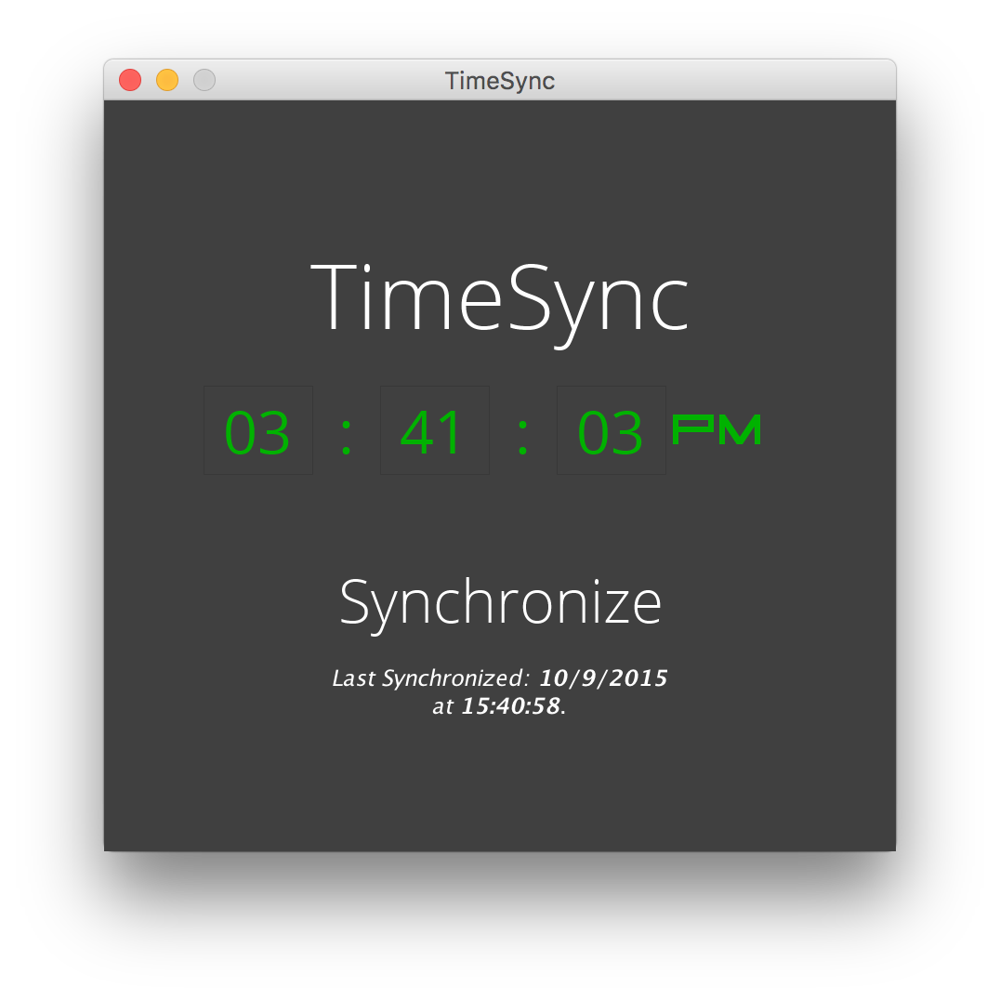
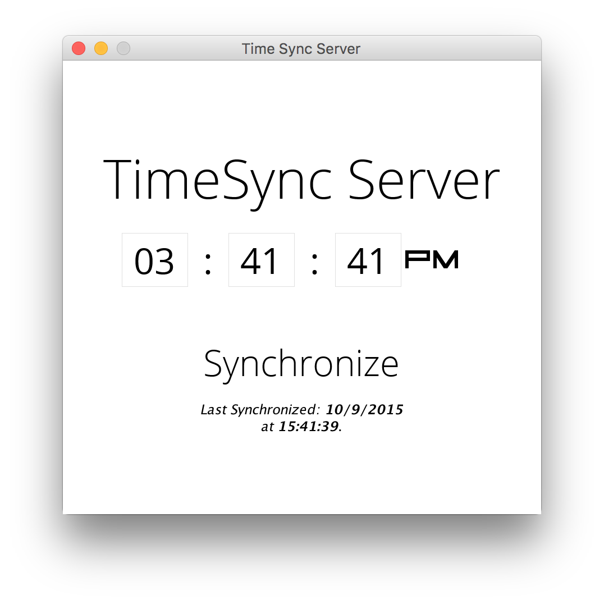

<link href='https://fonts.googleapis.com/css?family=Open+Sans:400,300,700' rel='stylesheet' type='text/css'>

<h1 class="TimeSyncLogo" style="font-family:Open Sans;font-weight:300;font-size:600%;text-align:center">TimeSync</h1>

<p class="authors" style="text-align:center;font-family:Open Sans;font-weight:300;margin-top:-20px;">Sam Dindyal | Balin Banh | Daniel Tran</p>
<br>

<div class="screenshots" style="text-align: center;">
	</img>
	</img>
</div>

<span class="TimeSyncLogo" style="font-family:Open Sans;font-weight:300;">TimeSync</span> is a simple Java application, written with the <code>javax.swing</code> package and as an assignment for Computer Networks I *(CPS706)*. It is composed of two parts, a client side and a server side; both of which feature their own user interface. The client and server communicate through the TCP protocol can selectively sync time and/or date, which is determined on the server side application.

In order to run <span class="TimeSyncLogo" style="font-family:Open Sans;font-weight:300;">TimeSync</span>, run <code>TimeSyncServer</code> first, and, with that running, run <code>TimeSyncClient</code>.<br><br>
***Please note that*** <span class="TimeSyncLogo" style="font-family:Open Sans;font-weight:300;">TimeSync</span> ***requires JRE 8 or newer.***

--
<br>

##OVERVIEW

In this implementation of a Client/Server application, <code>TimeSyncServerRuntime.java</code>, <code>TimeSyncRuntime.java</code>, and <code>DateTimePanel.java</code> are the main components of the system.
The objective of DateTimePanel.java is to keep track of time, and present it in a GUI.

<code>TimeSyncRuntime.java</code> and <code>TimeSyncServerRuntime.java</code> is the client/server representation within the application. Using TCP, <code>TimeSyncServerRuntime.java</code> waits opens a socket and waits for a response from the client. 

<br>
###<code>TimeSyncServerRuntime.java</code>
```java
private ServerSocket serverSocket;
```
```java
serverSocket = new ServerSocket(TimeSyncLibrary.TCP_SERVER_SOCKET);
```
*These two lines of code create a new TCP socket.*<br><br>

The <code>TimeSyncRuntime.java</code> then sends a response with a buffered reader and closes the socket. 
After which, <code>TimeSyncServerRuntime.java</code> opens a new socket, and sends the requested data back to <code>TimeSyncRuntime.java</code> and closes the socket.

The client and server both run on two separate threads, to avoid interfering with the UI.<br><br>

###<code>TimeSyncRuntime.java</code>
```java
private void connect() {
	try {
			clientSocket = new Socket(location, TimeSyncLibrary.TCP_SERVER_SOCKET);
			inputFromServer = new BufferedReader(new InputStreamReader(clientSocket.getInputStream()));
			outputToServer = new DataOutputStream(clientSocket.getOutputStream());
		} catch (Exception e){e.printStackTrace();}
	}
```
*The code snippet above creates a new TCP socket to receive input and to output to the server.*
<br><br>

```java
try {
		syncThread.join();
		System.out.println("SERVER RESPONSE: " + serverInput);
		listener.actionPerformed(new ActionEvent(this, ActionEvent.ACTION_PERFORMED, "", System.currentTimeMillis(), 0));
	}catch(Exception e){e.printStackTrace();}
```
*This code snippet is responsible for completing the syncing process between the client and the server. Because we are using multiple threads, we need to ensure that everything stays synchronized.*<br><br>

###<code>TimeSyncServerRuntime.java</code>
```java
public void start()
{
	System.out.println("Server started.");
	try {
			listen();
			connect();
			respond(clientInput);
			connectionSocket.close();
		}catch(Exception e)	{e.printStackTrace();}		
}
```
*In the code snippet above, the server is waiting for a request from the client. It closes the socket after responding.*<br><br>

```java
private void connect ()
{
	try {
			connectionSocket = serverSocket.accept();
			outputStream = new DataOutputStream(connectionSocket.getOutputStream());
			inputReader = new BufferedReader(new InputStreamReader(connectionSocket.getInputStream()));
		} catch(Exception e){e.printStackTrace();}
}
```

*The code in the snippet above is responsible for opening a socket for the client to send a request.*